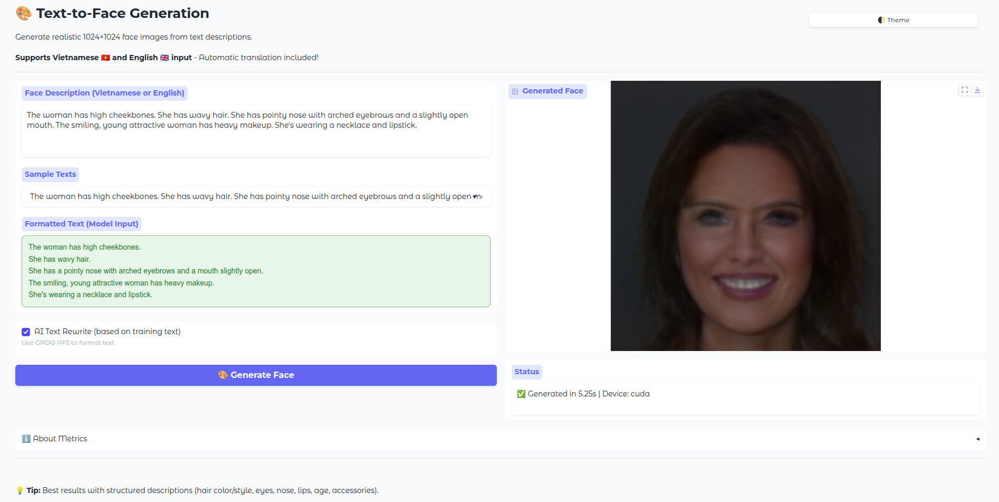

# Text-to-Face Generation Demo

Generate face images from text descriptions using BERT + StyleGAN2.

Training repo: https://github.com/thangthewinner/t2f_training 

## Requirements

- Python 3.12.9
- 4GB VRAM (GPU)

## Setup

### 1. Install Dependencies

```bash
pip install -r requirements.txt
```

### 2. Clone StyleGAN2 Repository

```bash
git clone https://github.com/NVlabs/stylegan2-ada-pytorch.git
```

### 3. Download Model Checkpoint

Download `checkpoint_epoch0500.pt` (629 MB) and place in `models/` folder:

**Google Drive:** https://drive.google.com/file/d/1FHynclzxW_KTxkekz1pMGTUludYIkKhv/view?usp=drive_link

### 4. Configure API Key (Optional)

For AI text formatting feature, create `.env` file:

Get free API key at: https://console.groq.com/keys

## Run

```bash
python app.py
```

Access at: **http://localhost:7860**

## Demo

